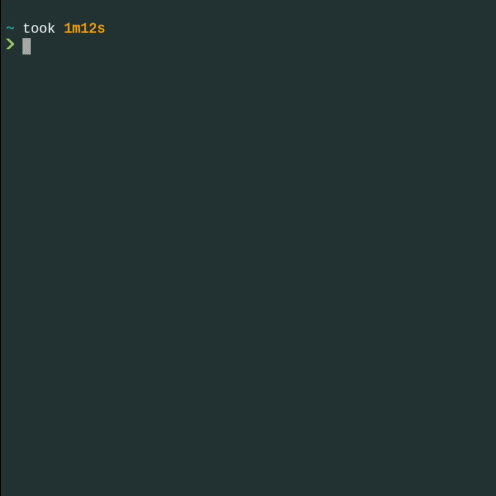
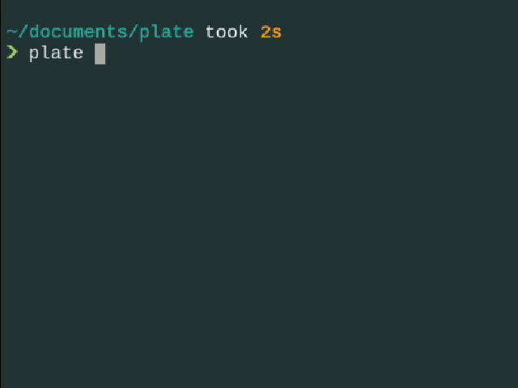

# plate
simple template generator

## basics
- using file extensions, create a template
- templates are stored in the HOME/.plate directory as their respective extension
- create any number of templates at once (similar or not)

 simple template generator
 create a template for your scripts and source using file extensions.

 open the created file in an editor with the -e option

 set file permissions with -p followed by an octal permission

 print the template without writing to a file, using -t

 explicitly define the file extension to use with -x

 files will not be overwritten by default

 place your templates in $HOME/.plate as the file extension they define
   ex.
       $HOME/.plate/cc
       $HOME/.plate/py
       $HOME/.plate/sh

